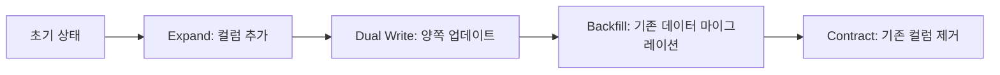

# DB Schema Migration Without Downtime

서비스 중단 없이 DB 스키마를 변경하는 실습 프로젝트입니다.

## 🎯 프로젝트 목적

**기술 블로그 글**: "서비스 중단 없이 DB 스키마 변경하기"의 실습 예제

실무에서 발생하는 다음과 같은 문제들을 해결하는 방법을 학습합니다:
- ALTER TABLE로 인한 서비스 장애
- 스키마 변경과 애플리케이션 배포 시점의 불일치
- 대용량 테이블의 무중단 스키마 변경

## 🏗️ 아키텍처

### 기술 스택
- **Backend**: Spring Boot 3.x + JPA
- **Database**: MySQL 8.0 (Master 1대 + Replica 2대)
- **Feature Flag**: Togglz (Spring Boot 통합)

### 주요 구성 요소
```
┌─ Controllers ─┐    ┌─ Services ─┐    ┌─ Database ─┐
│ UserController │    │ UserService │    │   Master   │
│ FeatureFlagController │ UserReadService │ │  (Write)   │
└───────────────┘    │ FeatureFlagService │ │            │
                     └─────────────┘    │  Replica 1  │
                                       │   (Read)    │
                                       │             │
                                       │  Replica 2  │
                                       │   (Read)    │
                                       └─────────────┘
```

## 🚀 Quick Start

### 1. 환경 실행
```bash
# MySQL 환경 시작
docker-compose up -d

# 애플리케이션 실행  
./gradlew bootRun
```

### 2. 기본 동작 확인
```bash
# 사용자 목록 조회
curl http://localhost:8080/api/users

# Feature Flag 상태 확인
curl http://localhost:8080/api/feature-flags
```

### 3. 실습 진행
상세한 실습 가이드는 [MIGRATION_GUIDE.md](./MIGRATION_GUIDE.md)를 참고하세요.

## 📝 실습 시나리오

### 현재 상황
- `users` 테이블: `first_name`, `last_name` 개별 관리
- 검색 성능 이슈로 `full_name` 컬럼 추가 필요

### 목표
- 서비스 중단 없이 `full_name` 컬럼 추가
- 기존 `first_name`, `last_name` 컬럼 제거
- 점진적 배포로 위험 최소화

## 🔄 Expand-Contract 패턴



## 🚩 Feature Flag 시스템 (Togglz)

### 지원 기능
- **Togglz 라이브러리**: Spring Boot와 완벽 통합
- **웹 콘솔**: 실시간 Feature Flag 관리 UI
- **읽기 전환**: 신규 스키마로 점진적 읽기 전환
- **점진적 배포**: 10% → 50% → 100% 단계적 적용
- **사용자별 적용**: 사용자 ID 해시 기반 일관된 적용

### API 예시
```bash
# Togglz 상태 확인
curl http://localhost:8080/api/feature-flags/status

# 신규 스키마 읽기 전환
curl -X PUT http://localhost:8080/api/feature-flags/new-schema-read \
  -H "Content-Type: application/json" \
  -d '{"enabled":true}'

# 사용자별 읽기 방식 확인
curl http://localhost:8080/api/feature-flags/user/1/status
```

### Togglz 웹 콘솔
- **URL**: http://localhost:8080/togglz-console
- **기능**: 웹 UI를 통한 실시간 Feature Flag 관리
- **장점**: 코드 변경 없이 즉시 Flag 상태 변경 가능

### ⚠️ Feature Flag 올바른 사용법
**중요**: Feature Flag는 **읽기 전환**에만 사용됩니다!

1. **Dual Write**: Feature Flag 없이 항상 실행 (Expand 단계)
2. **읽기 전환**: Feature Flag로 점진적 전환 (신규 vs 기존 스키마)
3. **Contract**: 모든 사용자가 신규 스키마로 전환 후 기존 컬럼 제거

### 실무 활용
Togglz는 다양한 저장소를 지원합니다:
- **메모리** (개발/테스트)
- **데이터베이스** (운영 환경 권장)
- **파일 시스템**
- **Redis** (분산 환경)

## 📊 Read-After-Write Consistency

### 문제 상황
```bash
# 1. 데이터 업데이트 (Master)
curl -X PUT http://localhost:8080/api/users/1/name \
  -d '{"firstName":"John","lastName":"Updated"}'

# 2. 즉시 읽기 (Replica) - 복제 지연으로 이전 데이터 조회 가능
curl http://localhost:8080/api/users/1
```

### 해결 방법
```bash
# 중요한 읽기는 Master에서 강제 조회
curl "http://localhost:8080/api/users/1?fromMaster=true"
```

## 🛠️ DDL 실행 가이드

### Online DDL (권장)
```sql
-- MySQL 8.0에서 INSTANT 알고리즘 사용
ALTER TABLE users 
ADD COLUMN full_name VARCHAR(255) NULL,
ALGORITHM=INSTANT, LOCK=NONE;
```

### Offline DDL 대안
```bash
# gh-ost를 사용한 무중단 스키마 변경
gh-ost \
  --host=localhost --port=3307 \
  --user=root --password=0000 \
  --database=moko --table=users \
  --alter="ADD COLUMN full_name VARCHAR(255) NULL" \
  --execute
```

## 📁 프로젝트 구조

```
src/main/java/io/spring/dbmigration/
├── config/
│   ├── DatabaseConfig.java        # Master/Replica 데이터소스 설정
│   └── FeatureFlagConfig.java     # Feature Flag 설정
├── controller/
│   ├── UserController.java        # 사용자 API
│   └── FeatureFlagController.java # Feature Flag 관리 API
├── service/
│   ├── UserService.java          # 사용자 비즈니스 로직
│   ├── UserReadService.java      # 읽기 전용 서비스 (Replica)
│   └── FeatureFlagService.java   # Feature Flag 로직
├── domain/
│   └── User.java                 # 사용자 엔티티
└── repository/
    └── UserRepository.java       # JPA Repository
```

## 🔍 모니터링 포인트

### 1. Feature Flag 적용률
```bash
# 사용자별 Feature Flag 확인
curl http://localhost:8080/api/feature-flags/user/{userId}/enabled
```

### 2. 복제 지연 모니터링  
```sql
-- Master에서 복제 상태 확인
SHOW MASTER STATUS;

-- Replica에서 지연 시간 확인  
SHOW SLAVE STATUS\G
```

### 3. 성능 비교
```bash
# Master vs Replica 응답 시간
time curl "http://localhost:8080/api/users?fromMaster=true"
time curl "http://localhost:8080/api/users?fromMaster=false"
```

## ⚠️ 주의사항

### DDL 실행 전 체크리스트
- [ ] 백업 완료
- [ ] 피크 시간 회피
- [ ] Dual Write 준비 완료
- [ ] 롤백 계획 수립

### 단계별 검증 필수
1. **Expand**: 컬럼 추가 후 애플리케이션 정상 동작 확인
2. **Dual Write**: 데이터 일관성 검증
3. **Contract**: 기존 컬럼 제거 전 100% 마이그레이션 완료 확인

## 📚 참고 자료

- [MySQL Online DDL](https://dev.mysql.com/doc/refman/8.0/en/innodb-online-ddl.html)
- [gh-ost](https://github.com/github/gh-ost)
- [Togglz 공식 문서](https://www.togglz.org/)
- [Togglz Spring Boot Integration](https://www.togglz.org/documentation/spring-boot-starter.html)

## 🤝 Contributing

실습 중 발견한 이슈나 개선 사항이 있다면 Issue를 등록해 주세요.
